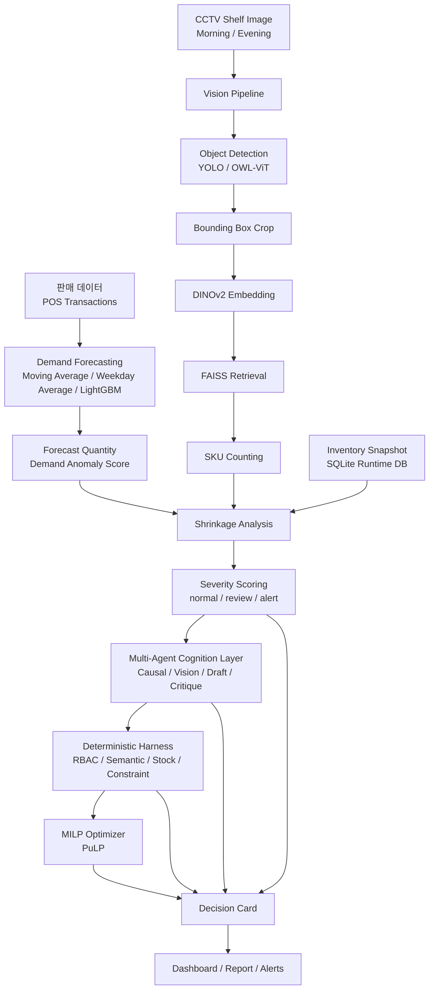

# D&B 2026 학술제 8팀

> **D&B 2026 학술제 출품 프로젝트**

# Vision LLM Inventory Agent

무인매장 재고 관리를 위해 POS 판매 데이터, CCTV 기반 실물 재고 인식, 수요 예측, 이상 상황 판단, AI Agent reasoning, 안전 검증, 발주 최적화를 하나의 파이프라인으로 연결한 AI 재고 지능 시스템입니다.  
이 프로젝트는 장부상 재고와 실제 선반 재고가 어긋나는 문제를 탐지하고, 위험도를 계산한 뒤, 안전한 자동 발주 의사결정을 지원합니다.  
핵심 아이디어는 **Forecast + Vision + Agent + Deterministic Harness + MILP Optimizer**를 결합해 설명 가능하고 통제 가능한 재고 운영 흐름을 만드는 것입니다.  
사용 기술은 LightGBM, DINOv2, FAISS, YOLO/OWL-ViT, OpenAI API, PuLP, SQLite를 포함합니다.

---

## 목차

- [1. 프로젝트 소개](#1-프로젝트-소개)
- [2. 프로젝트 목표](#2-프로젝트-목표)
- [3. 전체 시스템 아키텍처](#3-전체-시스템-아키텍처)
- [4. 주요 기능](#4-주요-기능)
- [5. 프로젝트 구조](#5-프로젝트-구조)
- [6. 사용 기술](#6-사용-기술)
- [7. 실행 방법](#7-실행-방법)
- [8. 결과 예시](#8-결과-예시)
- [9. 프로젝트 특징](#9-프로젝트-특징)
- [10. 확장 가능성](#10-확장-가능성)
- [11. 제작](#11-제작)

---

## 1. 프로젝트 소개

무인매장에서는 POS에는 판매 기록이 남지만, 실제 선반 재고는 도난, 파손, 오진열, 보충 지연, CV 오류 등으로 장부와 달라질 수 있습니다.  
본 프로젝트는 POS 기반 가상 재고와 CCTV 기반 실물 재고를 함께 분석하여 재고 불일치와 이상 상황을 탐지합니다.  
수요 예측 모델은 다음날 판매량을 예측하고, Vision Pipeline은 선반 이미지에서 상품 후보를 찾은 뒤 DINOv2와 FAISS로 SKU를 식별합니다.  
AI Agent는 이상 원인을 설명하고 발주 초안을 만들며, Deterministic Harness는 모든 발주 초안을 규칙 기반으로 검증합니다.

---

## 2. 프로젝트 목표

이 프로젝트의 목표는 무인매장의 재고관리 과정을 데이터와 AI 기반으로 자동화하는 것입니다.

| 목표 | 설명 |
|---|---|
| POS 기반 재고 관리 | 판매 데이터와 재고 snapshot을 기반으로 장부상 재고 흐름을 관리합니다. |
| CCTV 기반 실물 재고 인식 | CCTV shelf image에서 상품 후보 영역을 탐지하고 SKU별 수량을 계산합니다. |
| 수요 예측 | SKU별 다음날 판매량을 예측해 보충 필요성을 판단합니다. |
| 재고 손실 탐지 | 기대 재고와 실물 재고 차이를 기반으로 shrinkage를 계산합니다. |
| 이상 상황 탐지 | 수요 이상, 재고 부족, CV confidence를 결합해 severity를 산출합니다. |
| AI Agent 의사결정 | 예외 SKU에 대해 원인 후보, 시각적 근거, 발주 초안, 자기검토 결과를 생성합니다. |
| 안전한 자동 발주 | Deterministic Harness가 발주 초안을 검증하고, PuLP MILP Optimizer가 제약 조건 안에서 발주량을 계산합니다. |

---

## 3. 전체 시스템 아키텍처



---

## 4. 주요 기능

| 기능 | 설명 | 주요 파일 |
|---|---|---|
| SQLite Runtime DB | SKU, 재고, CV count, 예측, 이상 케이스, 발주 초안, Harness 결과를 하나의 DB로 관리합니다. | `synthetic_retail_company_dataset/retail_inventory.sqlite`, `src/retail_ai/db.py` |
| Synthetic Dataset Generator | MVP 실행에 필요한 매장, SKU, 판매, 재고, 이상 케이스 데이터를 생성합니다. | `tools/rebuild_synthetic_dataset.py`, `src/synthetic_data.py` |
| DINOv2 상품 임베딩 | Reference Gallery 이미지를 embedding으로 변환합니다. | `src/embedding.py`, `tools/build_embeddings.py` |
| FAISS SKU Retrieval | CCTV crop embedding과 reference embedding을 비교해 유사 SKU를 검색합니다. | `src/retail_ai/vision_counting.py` |
| CCTV 상품 카운팅 | Detection, crop, embedding, retrieval을 통해 SKU별 개수를 집계합니다. | `src/retail_ai/vision_counting.py`, `tools/count_products_in_image.py` |
| Detector Benchmark | YOLO와 OWL-ViT detector 결과를 같은 CCTV 이미지에서 비교하고 추천 detector를 선택합니다. | `src/retail_ai/detector_benchmark.py`, `tools/benchmark_detectors.py` |
| LightGBM 수요 예측 | Moving Average, Weekday Average, LightGBM을 비교하고 SKU별 forecast를 생성합니다. | `src/retail_ai/demand_forecasting.py` |
| Severity Scoring | demand anomaly, shrinkage, CV confidence를 결합해 위험도를 계산합니다. | `src/retail_ai/severity.py` |
| Multi-Agent Reasoning | 이상 케이스에 대해 원인 요약, 시각적 평가, 발주 초안, 자기검토를 수행합니다. | `src/retail_ai/agents.py`, `src/retail_ai/llm_client.py` |
| Deterministic Harness | Agent draft를 semantic, stock, constraint rule로 검증합니다. | `src/retail_ai/harness.py` |
| PuLP MILP Optimizer | 예산, 창고 용량, pack size, min/max order 제약을 만족하는 발주량을 계산합니다. | `src/retail_ai/optimizer.py` |
| Decision Card | Forecast, Vision, Agent, Harness, Optimizer 결과를 SKU별 의사결정 카드로 통합합니다. | `results/demo/decision_cards_demo.csv` |
| End-to-End Demo Dashboard | 전체 pipeline 결과를 HTML dashboard, CSV, JSON, figure로 생성합니다. | `src/retail_ai/demo_runner.py`, `tools/run_end_to_end_demo.py` |

---

## 5. 프로젝트 구조

```text
Vision_LLM_Inventory_Agent/
├─ src/
│  ├─ embedding.py
│  └─ retail_ai/
│     ├─ demand_forecasting.py
│     ├─ vision_counting.py
│     ├─ detector_benchmark.py
│     ├─ severity.py
│     ├─ agents.py
│     ├─ llm_client.py
│     ├─ harness.py
│     ├─ optimizer.py
│     ├─ demo_runner.py
│     └─ db.py
│
├─ tools/
│  ├─ build_embeddings.py
│  ├─ train_demand_forecast.py
│  ├─ benchmark_detectors.py
│  ├─ count_products_in_image.py
│  ├─ run_triage.py
│  ├─ run_agents.py
│  ├─ run_harness.py
│  ├─ run_optimizer.py
│  └─ run_end_to_end_demo.py
│
├─ tests/
│  ├─ test_embedding.py
│  ├─ test_vision_counting.py
│  ├─ test_detector_benchmark.py
│  ├─ test_demand_forecasting.py
│  ├─ test_severity.py
│  ├─ test_agents.py
│  ├─ test_harness.py
│  ├─ test_optimizer.py
│  └─ test_demo_runner.py
│
├─ data/
│  ├─ products/merge_dataset.csv
│  ├─ embeddings/
│  │  ├─ embeddings.npy
│  │  ├─ metadata.csv
│  │  └─ faiss.index
│  └─ simulation/
│     ├─ Morning.png
│     └─ Evening.png
│
├─ products_image/
│  └─ {sku_id}_{product_name}/
│     └─ {sku_id}_{height}_s_{angle}.jpg
│
├─ synthetic_retail_company_dataset/
│  ├─ retail_inventory.sqlite
│  ├─ csv/
│  └─ jsonl/
│
├─ results/
│  ├─ demand_forecasting/
│  ├─ detector_benchmark/
│  ├─ triage/
│  ├─ agents/
│  ├─ harness/
│  ├─ optimizer/
│  └─ demo/
│
├─ docs/
│  ├─ architecture_current.md
│  └─ project_code_guide_for_report_writers.md
│
├─ requirements.txt
└─ README.md
```

| 폴더 | 역할 |
|---|---|
| `src/` | 핵심 알고리즘과 비즈니스 로직이 구현된 Python 패키지입니다. |
| `tools/` | 각 모듈을 CLI로 실행하는 스크립트입니다. |
| `tests/` | 빠르게 검증 가능한 unit test입니다. API와 모델 의존성은 mock 또는 dry-run으로 분리합니다. |
| `data/` | 원천 데이터, embedding index, CCTV simulation image가 저장됩니다. |
| `products_image/` | SKU별 Reference Gallery 이미지입니다. DINOv2 embedding database 구축에 사용됩니다. |
| `synthetic_retail_company_dataset/` | SQLite runtime DB와 CSV/JSONL export가 저장됩니다. |
| `results/` | Forecast, Vision, Agent, Harness, Optimizer, Dashboard 결과물이 저장됩니다. |
| `docs/` | 아키텍처와 보고서 작성용 설명 문서가 저장됩니다. |

---

## 6. 사용 기술

| 구분 | 기술 | 사용 목적 |
|---|---|---|
| Language | Python | 전체 pipeline 구현 |
| Runtime DB | SQLite | synthetic retail runtime database |
| Data Processing | Pandas, NumPy | 데이터 전처리, feature engineering, 결과 집계 |
| Forecasting | LightGBM, scikit-learn | SKU별 수요 예측과 모델 평가 |
| Vision Model | YOLO, OWL-ViT | CCTV 이미지에서 상품 후보 bounding box 생성 |
| Embedding | DINOv2, PyTorch, Transformers | 상품 crop과 reference image를 embedding으로 변환 |
| Vector Search | FAISS | embedding 기반 SKU retrieval |
| LLM | OpenAI API | 예외 상황 reasoning과 order draft 생성 |
| Optimization | PuLP | MILP 기반 발주량 최적화 |
| Visualization | Matplotlib, Pillow | figure, detection preview, dashboard asset 생성 |
| Testing | pytest | 모듈별 자동 검증 |

---

## 7. 실행 방법

### 7.1 환경 설치

```bash
pip install -r requirements.txt
```

프로젝트에 필요한 Python 패키지를 설치합니다.

### 7.2 Reference Gallery embedding 생성

```bash
python tools/build_embeddings.py
```

`products_image/`의 SKU별 이미지를 DINOv2 embedding으로 변환하고 FAISS index를 생성합니다.

생성 파일:

```text
data/embeddings/embeddings.npy
data/embeddings/metadata.csv
data/embeddings/faiss.index
```

### 7.3 수요 예측 실행

```bash
python tools/train_demand_forecast.py
```

`data/products/merge_dataset.csv`를 기반으로 SKU별 다음날 판매량을 예측하고, model comparison과 metric을 저장합니다.

### 7.4 Detector benchmark 실행

```bash
python tools/benchmark_detectors.py \
  --images data/simulation/Morning.png data/simulation/Evening.png \
  --detectors yolo owlvit \
  --output-dir results/detector_benchmark \
  --conf-thresholds 0.05 0.1 0.2 0.3
```

CCTV simulation image에서 detector별 bounding box 결과를 비교하고 추천 detector를 저장합니다.

### 7.5 Vision detector smoke test

```bash
python tools/test_open_vocab_detector.py
```

기본 입력인 `data/simulation/Morning.png`에 대해 OWL-ViT detector를 실행하고 preview image와 JSON을 저장합니다.

### 7.6 Severity / Triage 실행

```bash
python tools/run_triage.py --date latest
```

Demand forecast, inventory snapshot, CV count를 결합해 SKU별 severity와 routing 결과를 계산합니다.

### 7.7 Multi-Agent 실행

```bash
python tools/run_agents.py --date latest --dry-run
```

검토가 필요한 SKU에 대해 Agent reasoning과 order draft를 생성합니다. OpenAI API 사용 시 `--dry-run` 없이 실행할 수 있습니다.

### 7.8 Deterministic Harness 실행

```bash
python tools/run_harness.py --date latest
```

Agent order draft를 deterministic rule로 검증하고, 승인/검토/차단 결과를 저장합니다.

### 7.9 MILP Optimizer 실행

```bash
python tools/run_optimizer.py --date latest --mode simulation
```

Harness 결과를 바탕으로 PuLP MILP optimizer를 실행해 발주량을 계산합니다.

### 7.10 End-to-End Demo 실행

```bash
python tools/run_end_to_end_demo.py \
  --date 2026-05-21 \
  --mode simulation \
  --detector auto
```

Forecast, Vision, Severity, Agent, Harness, Optimizer, Decision Card, Dashboard를 한 번에 실행합니다.

---

## 8. 결과 예시

`results/` 폴더에는 실행 단계별 산출물이 저장됩니다.

| 결과 폴더 | 주요 파일 | 설명 |
|---|---|---|
| `results/demand_forecasting/` | `forecast_predictions.csv`, `overall_metrics.json`, `model_comparison.csv`, `sku_metrics.csv` | 수요 예측 결과와 모델 성능 지표입니다. |
| `results/detector_benchmark/` | `benchmark_summary.csv`, `benchmark_summary.json`, `*.jpg`, `*.json` | detector별 bbox 수, confidence, 시각화 결과입니다. |
| `results/triage/` | `triage_results.csv`, `triage_summary.json`, `severity_distribution.png` | severity score와 routing 결과입니다. |
| `results/agents/` | `agent_outputs.json`, `order_drafts_from_agents.csv`, `agent_summary.md` | Agent reasoning과 발주 초안 결과입니다. |
| `results/harness/` | `harness_results.csv`, `decision_cards_final.csv`, `decision_cards_final.md` | Harness 검증 결과와 최종 decision card입니다. |
| `results/optimizer/` | `optimized_orders.csv`, `optimizer_summary.json`, `optimization_report.md` | MILP optimizer의 발주량 계산 결과입니다. |
| `results/demo/` | `demo_dashboard.html`, `demo_summary.json`, `decision_cards_demo.csv`, `alerts.csv` | End-to-End Demo 결과와 발표용 dashboard입니다. |
| `results/demo/figures/` | `pipeline_flow.png`, `severity_distribution.png`, `optimizer_summary.png` 등 | 보고서와 발표 자료에 사용할 figure입니다. |
| `results/demo/vision/` | `morning_detection.jpg`, `evening_detection.jpg`, `count_results.csv`, `retrieval_results.csv` | CCTV image 기반 detection, retrieval, count 결과입니다. |

End-to-End Demo summary 예시:

```text
Simulation Date: 2026-05-21
Morning Count: 9
Evening Count: 6
Alert Count: 4
Review Count: 4
Optimized Orders: 3
```

---

## 9. 프로젝트 특징

### Forecast와 Vision을 함께 활용한 재고관리

POS 판매 데이터만 보는 것이 아니라 CCTV 기반 실물 재고 인식 결과를 함께 사용합니다. 이를 통해 장부 재고와 선반 재고의 불일치를 탐지할 수 있습니다.

### Detection과 SKU 식별의 분리

YOLO와 OWL-ViT는 상품 후보 bounding box를 생성하는 데 사용됩니다. 최종 SKU 식별은 DINOv2 embedding과 FAISS retrieval이 담당합니다.

### AI Agent + Deterministic Harness 구조

Agent는 설명과 초안 작성을 담당하고, Harness는 안전 검증을 담당합니다. AI reasoning과 실행 검증이 분리되어 있어 의사결정 흐름이 설명 가능하고 통제 가능합니다.

### Runtime SQLite Database

외부 DB 없이도 synthetic data 기반 전체 pipeline을 실행할 수 있습니다. 판매, 재고, CV count, 예측, 이상 케이스, 발주 초안, 검증 결과가 하나의 SQLite DB에 연결됩니다.

### MILP 기반 발주 최적화

발주량은 단순 규칙이 아니라 예산, 창고 용량, pack size, 최소/최대 발주량을 함께 고려하는 정수 최적화로 계산됩니다.

### End-to-End Pipeline

단일 명령으로 Forecast, Vision, Severity, Agent, Harness, Optimizer, Decision Card, Dashboard를 생성할 수 있습니다.

---

## 10. 확장 가능성

| 방향 | 설명 |
|---|---|
| 다중 매장 지원 | store별 재고, 판매, CCTV stream을 분리해 운영 규모를 확장할 수 있습니다. |
| 실시간 CCTV Streaming | 현재 이미지 기반 pipeline을 streaming input으로 확장해 실시간 재고 변화를 추적할 수 있습니다. |
| 클라우드 배포 | SQLite 기반 MVP를 클라우드 DB와 API server 구조로 확장할 수 있습니다. |
| 모바일 관리자 앱 | Decision Card와 Alert를 모바일 UI로 제공해 현장 관리자의 검토 속도를 높일 수 있습니다. |
| ERP/POS 연동 | 실제 POS와 ERP 시스템에 연결해 판매, 재고, 발주 흐름을 통합할 수 있습니다. |
| 대규모 SKU 확장 | FAISS index와 SKU metadata를 확장해 더 많은 상품군을 처리할 수 있습니다. |
| 매장별 detector 최적화 | Detector benchmark 결과를 매장 환경별로 저장해 조명, 진열, 카메라 각도에 맞는 detector를 선택할 수 있습니다. |

---

## 11. 제작

# 제작

**D&B 2026 학술제 8팀**

Hanyang University

Data & Business 2026
