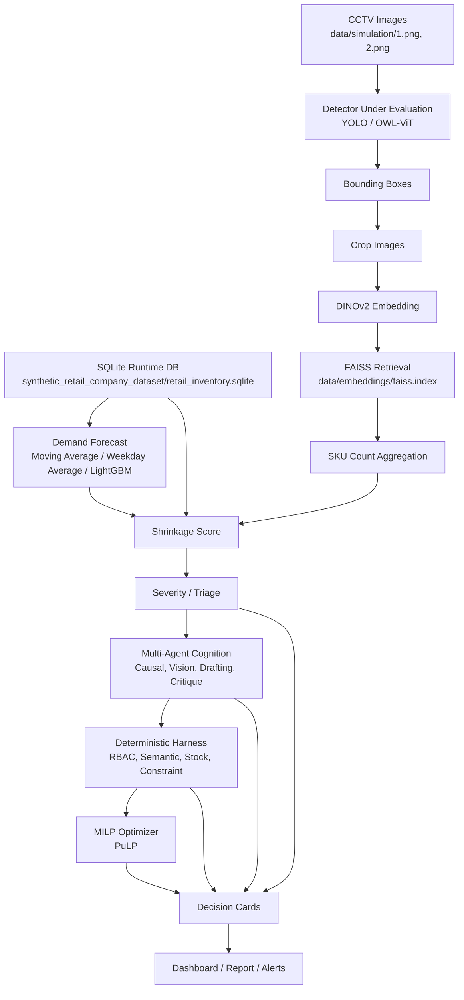

# 현재 구현 기준 아키텍처

이 문서는 초기 설계안이 아니라 현재 저장소에 구현되어 있는 코드와 데이터 구조를 기준으로 작성한 아키텍처 설명입니다.

## 1. 현재 구현 기준 전체 시스템

현재 시스템은 synthetic retail dataset과 reference gallery image를 기반으로 작동하는 MVP입니다. 핵심 목표는 POS 판매 데이터, CCTV 기반 상품 count, 수요 예측, 이상 탐지, Agent reasoning, deterministic validation, MILP optimization을 하나의 end-to-end 흐름으로 연결하는 것입니다.

전체 흐름은 다음과 같습니다.

```text
SQLite Runtime DB
-> Demand Forecast
-> Vision Pipeline
-> Shrinkage
-> Severity / Triage
-> Multi-Agent Cognition
-> Deterministic Harness
-> MILP Optimizer
-> Decision Card
-> Dashboard
```

현재 구현에서 DB는 `synthetic_retail_company_dataset/retail_inventory.sqlite`입니다. Reference Gallery embedding은 `data/embeddings/`에 저장됩니다. End-to-End 결과는 `results/demo/`에 생성됩니다.

## 2. 초기 설계와 실제 구현의 차이

### Demand Forecast

초기 설계에서는 LightGBM과 Prophet까지 고려하는 수요 예측 구조가 논의되었습니다. 실제 구현에서는 Prophet은 제외하고, Moving Average, Weekday Average, LightGBM을 time-series split으로 비교합니다. 현재 결과 기준 최종 선택 모델은 LightGBM입니다.

실제 구현 파일:

- `src/retail_ai/demand_forecasting.py`
- `tools/train_demand_forecast.py`

### Vision

초기에는 YOLO를 detector로 직접 사용하는 단순 구조를 생각할 수 있었지만, 실제 구현은 detector를 교체 가능한 계층으로 분리했습니다.

현재 Vision 구조:

```text
CCTV Image
-> Detector Under Evaluation
-> Bounding Box
-> Crop
-> DINOv2 Embedding
-> FAISS Retrieval
-> SKU Count
```

현재 detector 후보:

- YOLO via `ultralytics`
- OWL-ViT via `OpenVocabularyProductDetector`
- YOLO-World, GroundingDINO, Florence-2, Grounded-SAM은 후보 이름은 고려되어 있으나 현재 완전 실행 구현은 향후 확장 예정입니다.

중요한 차이:

> Detector label은 최종 SKU label로 사용하지 않는다. SKU 식별은 DINOv2 + FAISS retrieval에서 수행한다.

### Cognition Layer

실제 구현된 Cognition Layer는 네 개의 Agent로 구성됩니다.

- `CausalContextAgent`
- `VisionGroundedAgent`
- `OrderDraftingAgent`
- `SelfCritiqueAgent`

OpenAI API client가 구현되어 있고, quota 또는 API 오류가 발생하면 dry-run fallback으로 결과를 생성할 수 있습니다.

실제 구현 파일:

- `src/retail_ai/agents.py`
- `src/retail_ai/llm_client.py`
- `tools/run_agents.py`

### Harness

Harness는 현재 프로젝트의 안전 계층입니다. LLM Agent 결과를 바로 실행하지 않고 다음 검증을 수행합니다.

- RBAC Gateway
- Semantic Validation
- Stock Auditor
- Constraint Checker
- Retry count 관리
- Decision Card 업데이트

실제 발주 API 호출은 현재 구현 단계에서는 제외입니다. Harness는 DB에 검증 결과를 기록합니다.

실제 구현 파일:

- `src/retail_ai/harness.py`
- `tools/run_harness.py`

### MILP Optimizer

Optimizer는 PuLP 기반 MILP로 구현되어 있습니다.

두 가지 mode:

- `production`: Harness 결과가 `approved`인 SKU만 대상
- `simulation`: `approved`와 `requires_manual_review` SKU를 모두 포함

simulation mode는 발표/논문 데모용입니다. 실제 발주 실행이 아니라 "사람이 승인한다면 최적 발주량은 얼마인가"를 계산합니다.

실제 구현 파일:

- `src/retail_ai/optimizer.py`
- `tools/run_optimizer.py`

### End-to-End Demo

End-to-End Demo는 새 알고리즘이 아니라 기존 모듈을 연결하는 orchestration 계층입니다.

실제 구현 파일:

- `src/retail_ai/demo_runner.py`
- `tools/run_end_to_end_demo.py`

현재 demo는 다음 파일을 생성합니다.

- `results/demo/demo_dashboard.html`
- `results/demo/demo_summary.json`
- `results/demo/demo_report.md`
- `results/demo/decision_cards_demo.csv`
- `results/demo/alerts.csv`
- `results/demo/figures/*`

## 3. 현재 구현 기준 Mermaid Flowchart



## 4. 보고서용 아키텍처 설명

본 시스템은 예측, 인식, 추론, 검증, 최적화를 분리한 안전 중심 재고 의사결정 구조이다. Demand Forecasting은 POS 기반 미래 수요를 예측하고, Vision Pipeline은 CCTV 이미지에서 실물 재고 후보를 계산한다. 두 결과는 Shrinkage와 Severity module에서 결합되어 정상, 검토 필요, 동결 및 알림 상태로 라우팅된다.

예외 케이스는 Multi-Agent Cognition Layer로 전달되어 원인 후보와 발주 초안을 생성한다. 그러나 Agent는 직접 발주를 실행하지 않는다. 모든 order draft는 Deterministic Harness를 통과해야 하며, Harness는 SKU, 공급사, 재고, 예산, 창고 용량, severity 등 정형 규칙을 검증한다. 최종적으로 MILP Optimizer는 Harness 결과를 바탕으로 제약조건을 만족하는 발주량을 계산하고, Decision Card와 Dashboard는 사람이 검토 가능한 형태로 결과를 제공한다.

이 구조의 핵심은 AI reasoning과 deterministic safety control을 분리했다는 점이다. LLM은 설명과 초안 작성에 사용되고, 실행 권한은 Harness와 database layer에 제한된다.

## 5. 현재 구현의 핵심 기여

### SQLite Runtime DB 구축

MVP가 외부 DB 없이 실행되도록 SQLite 기반 runtime database를 구성했습니다. `sku_master`, `sku_images`, `inventory_snapshot`, `cv_count_log`, `demand_forecasts`, `anomaly_cases`, `order_drafts`, `harness_results`, `order_history`, `decision_cards`가 주요 흐름을 지탱합니다.

### Demand Forecast + Vision + Agent + Harness 통합

수요 예측, CCTV count, 이상 탐지, agent reasoning, deterministic validation이 하나의 흐름으로 연결되어 있습니다.

### LLM 직접 발주 방지

Agent는 `order_drafts`와 `agent_summary`만 생성합니다. 발주 승인 또는 차단은 Harness가 담당합니다.

### PuLP 기반 MILP Optimizer

발주량 계산은 단순 greedy가 아니라 예산, 창고 용량, min/max order, pack size를 반영하는 정수 최적화로 구현되어 있습니다.

### End-to-End Demo Pipeline

`tools/run_end_to_end_demo.py`는 발표용 dashboard, summary, report, alert, decision card, figures를 자동 생성합니다.

## 6. 현재 실행 결과 예시

최근 detector benchmark 결과:

```text
recommended detector: yolo
confidence threshold: 0.2
total detections across two images: 17
average detection count: 8.5
average confidence: 0.4641
```

최근 End-to-End Demo 결과:

```text
Simulation Date: 2026-05-21
Processed SKU: 4
Morning Count: 11
Evening Count: 6
POS Sales: 445
Total Shrinkage: 1.0
Alert Count: 4
Review Count: 4
Freeze Count: 0
Optimized Orders: 3
LLM Dry-run Fallback: True
```

## 7. 현재 구현 단계에서는 제외된 항목

- 실제 발주 API 호출
- 실제 POS API 연동
- 실시간 CCTV streaming
- 실제 매장 CCTV 데이터셋 기반 정량 검증
- detector fine-tuning
- 다중 매장 운영
- YOLO-World, GroundingDINO, Florence-2, Grounded-SAM의 완전 실행 통합

## 8. 향후 확장 예정

- 실제 CCTV image와 annotation 확보
- detector benchmark 확대 및 매장 환경별 detector 선택
- planogram constraint를 Vision retrieval 단계에 더 강하게 적용
- POS API와 주문 API 연동
- Harness 이후에만 실행되는 실제 발주 adapter 추가
- streaming inference pipeline 구축
- multi-store / multi-camera database schema 확장
- Human review feedback을 anomaly case library로 축적

## 9. 보고서 작성자가 먼저 읽으면 좋은 섹션

1. `docs/project_code_guide_for_report_writers.md`의 "프로젝트 개요"
2. 본 문서의 "현재 구현 기준 Mermaid Flowchart"
3. `docs/project_code_guide_for_report_writers.md`의 "주요 코드 파일 설명"
4. `docs/project_code_guide_for_report_writers.md`의 "현재 구현 한계"
5. `results/demo/demo_report.md`
6. `results/demo/decision_cards_demo.csv`
